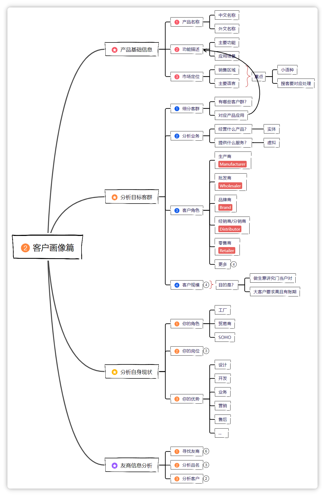

<!-- Title Line-->
# 跨境全链路-Ai做图工具

<!-- First Quote use as a part to Guide and attract readers -->
:::tip[你是不是也想这样？]
- ✅ 30天，找到 10 个海外合作伙伴
- ✅ 2天，就收到 3 个明确的合作意向
- ✅ 0基础，从外贸新手也能做到
别担心，这不是天方夜谭。本文将分享一个真实的逆袭故事，并把所有方法一步步教给你！
:::

<!--This Part is use for how to effectively find, screen and determine suitable customers -->
**这篇学完，你就能：**
明白自家产品的小秘密，知道从哪儿下手找客户。
学会把市场上的客户分分类，看看哪些跟你最"投缘"。
知道自己和公司有啥强项，找客户更有底气。
掌握一套选客户、定目标的好方法。
信心满满地找到那些最适合你的外贸伙伴！

<!--
`图示：SEO学习指南`-->

## 一、关于SEO

<!--This Part is use for  -->
> 改變是生命的法則，並且那些只看著過去或現在的人，肯定會錯過未來 - Mark Twain
> 

<aside>
💡

**教程更新说明**

**2025.6.27 更新**

本次教程更新全面优化了阅读简洁度，增加了线上版本和线下版本的区分，增加了最新Kontext章节，增加了本地Flux部署教程。

**2025.1.27 更新**

更新了全Flux支持，画面真实度上升500%，小尺寸选取生成不再模糊。

**2024.12.23 更新**

优化了教程结构，提高学习体验；添加了更多实例和操作演示；修复了部分排版和链接问题；更新了部分工具的最新版本使用方法。

</aside>

## **Ai前端-Krita**-图片操作界面P1

### **下载Krita**

> • [Krita V5.2 For Windows](https://mirrors.aliyun.com/kde/Attic/krita/5.2.6/krita-x64-5.2.6-setup.exe)
> 
> 
> • [Krita V5.2 For Mac](https://mirrors.bfsu.edu.cn/kde/stable/krita/5.2.9/krita-5.2.9-release.dmg)
> 

### **Ai插件以及安装教程**

> 使用在线的服务器或者本地Ai离线进行Ai生成。支持Win10和11, Mac系统。
> 
> 
> [下载插件](https://list.neoxu.store/d/editor_design/krita-app/krita_ai_diffusion-1.36.1.zip)
> 

> 打开Krita（确保是中文版本）
> 
> 1. 菜单栏： **设置**‣ Switch Application Language(语言选项)… ，这将弹出语言**设置**对话框。
> 2. 点击Primary language (首选语言) 右侧的下拉菜单，选择你想要使用的语言(简体**中文**)。
> 3. 点击OK (确定) 按钮关闭对话框。
> 4. 重新启动**Krita**。
> 
> 点击工具-脚本-从文件导入Python插件
> 
> 
> 
> 选择下载的zip插件（版本可能有不同，按照你下载的版本）
> 
> 
> 
> 提示要立即启用插件吗？选择是
> 关闭Krita再打开
> 

### Ai插件-本地离线模块（本地免费生成）

> **Krita ComfyUI 客户端**
> 

> **Krita ComfyUI 客户端是提供 Krita 本地 AI 功能的客户端。**
> 


> **下载信息**
> 
> 
> **下载地址：** https://pan.quark.cn/s/64b808baa960
> 
> **解压密码：** bilibili-秋葉aaaki
> 

下载后解压


```jsx
系统要求
Python 3.11
Pytorch 2.5.1
ComfyUI 内核 v0.3.13
版本信息
更新日期： 2025.2.4
版本： v1.6
SHA1 校验码： C70C920D545FE479BC416115657238CA2BA0F761
```

```jsx
#更新内容
新增部分常用节点
删除大量无用/过时节点
精简总插件数量 28 -> 21
整合包本身是把内核、插件版本对齐的，解压直接用就好，不要乱更新
更新时、内核与插件要都更新到最新，不要只更新内核或者只更新插件会出问题

```

## 本地离线生成模块配置-P2-a：

> **步骤 1:**
> 
> 
> 下载并启动客户端
> 
> 
> 
> **步骤 2:**
> 
> 切换版本 打开后点击侧边栏版本管理，勾选0.3.42，点击切换
> 
> 
> 
> **步骤 3:**
> 
> 确认安装
> 
> 弹出您确定要安装xx版本吗？点击确定，等待安装完成
> 
> 
> 
> **步骤 4:**
> 
> 安装模型文件
> 
> 下载模型文件安装到指定文件夹，模型文件下载地址:
> 
> SDXL小模型版本（80G）
> 
> [https://pan.quark.cn/s/a7e0f76d175c#/list/share](https://pan.quark.cn/s/a7e0f76d175c#/list/share%E3%80%82)
> 
> FLUX全量版本（120G）
> 
> https://pan.quark.cn/s/367652aeec59
> 
> **步骤 5:**
> 
> 一键启动
> 
> 重启绘世启动器，点击侧边栏-高级选项，右上角，一键启动
> 
> 
> 
> **步骤 6:**启动成功界面
> 
> 等待启动成功，然后网页端会有如下界面
> 
> 
> 
> **步骤 7:**
> 
> 安装插件
> 
> 为了兼容Krita，需要在Comfyui安装一些必要的插件，点击manage
> 
> 
> 
> **步骤 8:**
> 
> 自定义节点管理器
> 
> 点击custom nodes manager
> 
> 
> 
> **步骤 9:**安装tooling nodes
> 
> 搜索tooling nodes 点击install（提示你要Restart不要点击，继续按照教程操作）
> 
> 
> 
> **步骤 10:**
> 
> 选择tooling nodes版本
> 
> Select version选择latest 然后点击Select
> 
> 
> 
> **步骤 11:**
> 
> 安装inpaint nodes
> 
> 搜索输入inpaint nodes，再点击install，需要选择版本的话和上次一样选择latest
> 
> 
> 
> **步骤 12:**
> 
> 不要在此重启
> 
> 以上插件安装好以后，不要在这里点击restart
> 
> 
> 
> **步骤 13:**
> 
> 回到启动器启动
> 
> 回到绘世启动器，点击一键启动
> 
> 
> 
> **步骤 14:**
> 
> 等待命令行提示 等待命令行一直跳到:To See the GUI go to
> 
> 
> 
> **步骤 15:**Krita连接设置
> 
> 回到Krita，点击Ai生成设置，在连接，自定义服务器，输入127.0.0.1:8188（这个后面的数字和上一个页面的最后4个数字一样就可以）
> 
> 
> 

> 云端部署（仙宫云）
> 

登录链接：https://www.xiangongyun.com/console/instance

> 登录后 访问这个链接
> 
> 
> https://www.xiangongyun.com/image/detail/5f64ceb1-edab-4989-9cca-2bf3e9bb75ba?r=189WCA
> 
> 点击立即部署
> 
> 
> 
> 按照如下配置，点击确认部署（新账号需要实名认证）
> 
> 
> 

> 成功后会显示正在部署，完成会显示运行中。
> 
> 
> 
> 

> 
> 
> 
> [krita-ai-2.mp4](attachment:d6df1dad-060a-492b-b3f4-f9a52f7b0a6d:krita-ai-2.mp4)
> 

> 如何使用本机的Krita远程访问仙宫云的服务：
> 
> 
> 回到这个链接：
> 
> https://www.xiangongyun.com/console/instance
> 
> 点击Comfyui
> 

> 
> 
> 
> 
> 

> 复制弹出窗口的链接 粘贴到Krita 服务器网址，再点击连接
> 
> 
> 
> 

## **软件教程：**

> 新手入门
> 
> 
> [krita-tapering.mp4](attachment:5e20fc5f-4233-42cd-9577-5db207bebfb6:krita-tapering.mp4)
> 

> **图生图**
> 
> 
> [face-gatherer.mp4](attachment:9afb34f3-29fa-4b83-9ae5-e60fc3661b3f:face-gatherer.mp4)
> 
> [案例下载](https://list.neoxu.store/d/editor_design/krita-assets/face-gatherer.kra)
> 
> [dog3.kra](https://list.neoxu.store/d/editor_design/krita-assets/dog3.kra)
> 

> **扩展生成**
> 
> 
> [expand-Slab.mp4](attachment:10fe52f3-559f-4bfe-8624-fa211d71be6a:expand-Slab.mp4)
> 
> [案例下载](https://list.neoxu.store/d/editor_design/krita-assets/expand-Slab.kra)
> 

> 
> 
> 
> [remove-nimble-1.mp4](attachment:4b1408b1-d93f-4ae6-aaff-395e681d7bd4:remove-nimble-1.mp4)
> 
> [案例下载](https://list.neoxu.store/d/editor_design/krita-assets/remove.kra)
> 

> 风扇实例
> 
> 
> [fan-tag.mp4](attachment:f489ec49-3194-41d8-b59a-66508b605caf:fan-tag.mp4)
> 
> 图生文模块已取消，直接拖入豆包，点击解释图片。
>