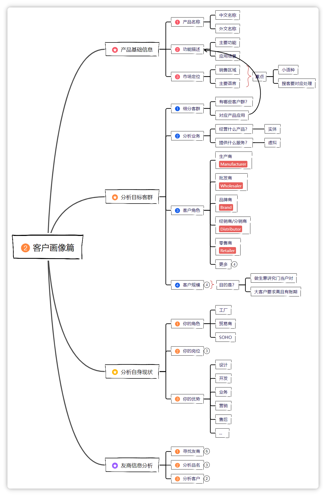

<!-- Title Line-->
# Ecom Landers | 构建高转化率的销售漏斗

<!-- First Quote use as a part to Guide and attract readers -->
:::tip[你是不是也想这样？]
- ✅ 一套让转化率提升47%、销售翻倍的增长的落地页
- ✅ 限免咨询，仅开放前50名品牌
- ✅ 真正建立一个**真实的**品牌
别担心，这不是天方夜谭。本文将分享一个真实的逆袭故事，并把所有方法一步步教给你！
:::

<!--This Part is use for how to effectively find, screen and determine suitable customers -->
**这篇学完，你就能：**
了解顶尖Shopify品牌如何设计其销售漏斗
掌握先进的转化架构提升转化率和平均订单价值（AOV）
实现盈利性规模化增长
学会构建高转化率的电商落地页

`图示：电商销售漏斗，帮您了解如何构建高转化率的电商落地页`

## 一、顶尖Shopify品牌在2025年如何构建其销售漏斗

在未来5年，电子商务将分为两类：

1.  **通过漏斗基础设施实现利润复合增长的品牌**
2.  **试图通过付费媒体强行规模化而烧钱的品牌**

区别不在于产品，也不在于广告创意。

**而在于你的店铺前端架构在多大程度上被精心设计，以便在压力下、有目的地、快速地转化。**

<!--This Part is use for  -->
:::warning[💡 为啥先要搞懂产品？]
这不是你的创意问题，也不是你的报价问题，而是完全缺乏 **转化架构（conversion architecture）**。
:::

### 1. 90%的Shopify品牌建立在为2021年流量环境设计的结构上

- **为啥要清楚这个问题？**
  > - 毫无策略或数据支持的通用或模板化产品详情页（PDPs），对冷流量转化效果不佳。
  > - 基于主题的UX/UI，并非为高额付费获客而设计。
  > - 没有叙事，零垂直结构，完全缺乏漏斗意图。
  > - 使用App堆砌的"捆绑销售构建器"，破坏了速度和清晰度。
  > - 为美学而非转化优化的"潮人页面"。

- **怎么做呢？**
  > 1. **更新你的漏斗架构**：摆脱2021年为低竞争环境设计的模板化结构。
  > 2. **重新设计PDPs**：基于数据和策略，而非通用模板。
  > 3. **建立垂直结构**：为每个广告角度创建专门的漏斗路径。

#### ① 来看看例子

| 项目 | 内容 |
| ---- | ---- |
| 常见问题 | 毫无策略或数据支持的通用或模板化产品详情页（PDPs） |
| 解决方案 | 基于数据的定制化漏斗设计 |

### 2. 为什么付费媒体救不了你

- **为啥要弄清付费媒体局限性？**
  > - 自2021年以来，Meta、TikTok和Google的CPM（千次展示成本）上涨了42%
  > - 广告疲劳周期比iOS 14之前缩短了50-70%
  > - 普通DTC品牌的最佳和最差漏斗之间的ROAS（广告支出回报率）差异高达3.2倍

- **怎么做呢？**
  > 1. **优化漏斗性能**：降低CAC压力，提升转化率。
  > 2. **提高AOV**：通过捆绑销售和追加销售增加单次会话收入。
  > 3. **提升漏斗速度**：减少每个转化步骤的成本。

#### ② 来看看例子

- **主要挑战：**

| 挑战 | 描述 |
| ---- | ---- |
| **CPM上涨** | 自2021年以来上涨42%，获客成本大幅增加 |
| **广告疲劳** | 周期缩短50-70%，需要更频繁更新创意 |
| **漏斗差异** | 最佳和最差漏斗ROAS差异高达3.2倍 |

- **应对策略：**
  - 当你的流量进入一个未经优化的漏斗时，它就会流失。
  - 当你每月花费5万英镑以上时，这些流失会让你损失数十万的利润。
  - **在规模化面前，利润就是一切。**

---

### 3. 今天的买家真正在做什么（而不是你的想当然）

- **为啥要明确买家行为？**
  > - 移动端的平均会话时长**少于47秒**。
  > - 83%的购买决策在**三次拇指滚动**内完成。
  > - 如果访问者没有获得**即时的上下文或情感共鸣**，他们会立刻跳出。
  > - 买家不仅想知道产品是**什么**，他们更想知道**为什么是现在**，**为什么是这个**，以及**为什么是你**。

- **怎么做呢？**
  > 1. **优化移动端体验**：确保在47秒内传达核心价值。
  > 2. **精简决策流程**：在三次滚动内完成关键信息传达。
  > 3. **增强情感共鸣**：建立即时的上下文和情感连接。

#### ③ 来看看例子

| 项目 | 内容 |
| ---- | ---- |
| 用户行为 | 移动端平均会话时长少于47秒 |
| 决策速度 | 83%的购买决策在三次拇指滚动内完成 |
| 关键要素 | 即时的上下文或情感共鸣 |

---

## 二、描绘我们的理想客户：他们是谁？

### 1. 给客户分分类，看得更清楚

- **目的：** 把市场上形形色色的潜在客户分成不同的小组，这样我们就能针对每个小组的特点，想出不同的"追求"办法。

- **步骤：**
  > 1. **列出可能的目标客户群**：想一想我们的电商漏斗服务一般都能用在哪些地方，这样就能大概知道哪些类型的公司可能会买。
  >    - 比如，如果我们做的是 **Shopify漏斗优化** 服务，那客户可能是做DTC品牌的，像是健康补充剂品牌；也可能是某个时尚品牌的公司。
  > 2. **连连看，服务具体用在哪**：把这些客户群和我们的服务具体用途对应起来。
  >    - 还拿 **Shopify漏斗优化** 来说，有的客户可能是想提升转化率，有的可能需要提高AOV。

#### ① 来看看例子

- **1️⃣ 客户群分类 及 潜在客户名称**

| 客户群分类 | 潜在客户名称 |
| ---- | ---- |
| **DTC品牌** | 健康补充剂品牌、时尚品牌、美妆品牌 |
| **Shopify商家** | 中小型电商、大型零售商 |
| **跨境电商** | 欧美市场品牌、新兴市场品牌 |

- **2️⃣ 对应 服务应用 及可能需求的 解决方案**

| 客户群分类 | 服务应用描述 | 可能需求的解决方案 |
| ---- | ---- | ---- |
| DTC品牌 | 需要通过漏斗优化提升转化率和AOV | **定制化漏斗设计**、**A/B测试**、**数据分析** |
| Shopify商家 | 需要专业团队优化现有店铺 | **PDP优化**、**落地页设计**、**捆绑销售策略** |
| 跨境电商 | 需要适应不同市场的转化策略 | **本地化漏斗设计**、**文化适配**、**多语言支持** |

### 2. 客户公司都做些啥生意？

- **目的：** 了解客户公司主要卖什么产品、提供什么服务，这样我们就能更好地判断他们到底需要什么。

- **步骤：**
  > 1. **看看客户卖啥实体产品**：列出客户主要卖的看得见摸得着的产品，比如健康补充剂、服装、美妆产品这些。
  > 2. **了解客户有啥增值服务**：看看客户有没有提供一些额外的服务，比如订阅服务、会员计划、个性化定制什么的。

#### ① 来看看例子

**客户经营的产品：**

| 潜在客户名称 | 实体产品 |
| ---- | ---- |
| **健康补充剂品牌** | 维生素、矿物质补充剂、草本提取物 |
| **时尚品牌** | 服装、鞋履、配饰 |
| **美妆品牌** | 护肤品、彩妆、个人护理产品 |
| **科技产品品牌** | 电子产品、智能设备、配件 |

**客户提供的服务：**

| 潜在客户名称 | 虚拟增值服务描述 |
| ---- | ---- |
| **健康补充剂品牌** | 订阅服务、营养师咨询、个性化推荐 |
| **时尚品牌** | 会员计划、造型建议、定制服务 |
| **美妆品牌** | 虚拟试妆、皮肤分析、个性化护肤方案 |
| **科技产品品牌** | 技术支持、保修服务、软件更新 |

### 3. 客户在生意链条里是啥角色？

- **目的：** 搞清楚客户在整个生意链条里扮演什么角色，能帮我们更有针对性地跟他们推销。

**常见的客户角色：**

| 中文名称 | 英文名称 | 角色说明 |
| ---- | ---- | ---- |
| **品牌商** | **Brand Owner** | **拥有品牌所有权，负责品牌推广和销售** |
| **零售商** | **Retailer** | **直接向终端消费者销售产品** |
| **分销商** | **Distributor** | **从生产商进货，再卖给零售商或其他中间商** |
| **电商平台** | **E-commerce Platform** | **提供在线销售平台和服务** |
| **服务商** | **Service Provider** | **提供各种服务，如营销、物流、技术等** |

#### ① 来看看例子

| 潜在客户名称 | 中文角色 | 英文角色 | 角色说明 |
| ---- | ---- | ---- | ---- |
| **健康补充剂品牌** | 品牌商 | Brand Owner | 自己拥有品牌，负责产品推广和销售 |
| **时尚品牌** | 品牌商 | Brand Owner | 自己拥有品牌，通过多种渠道销售 |
| **美妆品牌** | 品牌商 | Brand Owner | 自己拥有品牌，注重用户体验和品牌形象 |
| **科技产品品牌** | 品牌商 | Brand Owner | 自己拥有品牌，提供技术支持和售后服务 |

### 4. 客户公司有多大块头？

- **目的：** 了解客户公司的规模大小，能帮我们评估合作起来顺不顺利，风险大不大。

- **规模怎么看：**
  > - **小型客户：** 公司不大，但老板拍板快，订单可能小点，不过以后可能会发展壮大。
  > - **中型客户：** 规模适中，买东西爽快，决定事情的流程也相对简单。
  > - **大型客户：** 公司很大，订单也大，但通常要求也高，还可能要等一段时间才能收到钱，得小心风险。

#### ① 来看看例子

| 潜在客户名称 | 客户规模 | 说明 |
| ---- | ---- | ---- |
| **大型DTC品牌** | 大型 | 全球知名的品牌，生意遍布世界各地，块头非常大，但要求也高 |
| **中型Shopify商家** | 中型 | 在特定领域或地区有一定市场份额，决策流程相对简单 |
| **小型创业品牌** | 小型 | 刚起步的品牌，决策快但预算有限，需要高性价比方案 |

## 三、咱们自己是啥情况？

### 1. 咱们公司是哪一型？

**目的：** 弄清楚咱们自己公司是技术服务商、营销 agency 还是咨询公司，这样才能更准地找到那些跟咱们最合拍的客户。

**常见的公司类型：**
> - **技术服务商：** 有专业的技术团队，擅长漏斗开发和优化，成本控制好。不过，可能不太擅长品牌营销。
> - **营销 agency：** 特别会做品牌推广和市场营销，客户资源多。但是可能技术实力不足，有时候客户的特殊技术要求可能满足不了。
> - **咨询公司：** 专业分析能力强，能提供深度策略建议。但执行能力可能有限，需要合作伙伴来实施。

👉 **重要提醒**：如果我们是技术服务商，可得把眼睛擦亮了，找准适合自己的客户群。万一碰上那种只要策略不要执行的客户，他们不仅预算可能有限，要求还特别多，咱们可能辛辛苦苦半天，不仅没赚到钱，还可能把老本都赔进去。

### 2. 你在团队里是啥岗位？

**目的：** 清楚自己在团队里负责啥，这样在找客户的时候，就知道自己该使多大劲儿，往哪个方向使劲儿。

> - **如果你是技术负责人**：那你得熟悉整个漏斗技术架构，多开发些高效的解决方案，把技术壁垒做高。你在一线实践，最了解技术难点和突破点，要把这些有用的信息及时告诉团队，也多出出主意。
> - **如果你是销售负责人**：那你就得经常跟大客户打交道，同时也要多听听技术和产品同学的想法。带着大家一起想办法，把事情做得漂漂亮亮，给老板当好参谋，保证团队能一直有项目做，顺顺利利地运转。
> - **如果你是老板**：那你得把握公司的大方向，大力支持业务拓展工作。你要带领整个团队一起往前冲，保证公司能持续接到项目、赚到钱，让公司一天比一天强大。

👉 **一句话总结**：不管是老板、经理还是小兵，找客户这事儿，人人都重要，都得一起使劲儿！

### 3. 咱们有啥"独门绝技"？

**目的：** 亮出咱们的强项，让客户一眼就看中我们！

**咱们可能有的优势：**
> - **技术开发能力强：** 有特别厉害的开发团队，能做出高性能的电商漏斗。
> - **数据分析牛：** 数据分析能力过硬，客户有啥转化问题，咱们都能搞定。
> - **客户资源广：** 认识的客户多，电商行业经验丰富。
> - **营销策略多：** 熟悉各种推广渠道，能把漏斗优势送到潜在客户眼前。
> - **售后服务好：** 项目交付不算完，还能提供又快又好的技术支持，让客户用得放心。

**小提示：** 把咱们的这些优势跟客户的需求结合起来，专门去找那些看重咱们这些优点的客户，签单的成功率才会更高哦！

## 四、看看"隔壁老王"：友商在干啥？

- **目的：** 研究一下竞争对手们都在做些什么，能帮我们了解市场行情，甚至还能从他们那里发现一些咱们可以去开发的潜在客户。

### A. 怎么找到我们的友商？

- **方法：**

  > 1. 📚用谷歌搜搜看： 在谷歌上搜索一下跟我们做类似电商漏斗优化的公司。
  > 2. 📚B2B 平台上找找： 在Clutch.co这类B2B平台上看看有没有同行。
  > 3. 📚其他更多方法： 可以参考行业报告和案例研究，里面有更多找友商的技巧。

---

### B. 友商的产品都叫啥名？

- **方法：**
  > - 多去友商的公司官网和他们在行业平台上的店铺逛逛，看看他们的服务都叫什么名字，是怎么描述的。
  > - 把那些常用的服务名称收集起来，可以帮我们优化自己服务的叫法和描述，让更多人搜到我们。

- **从哪儿看：**
  > - **独立网站**：通过友商自己公司网站上的服务名称，了解常用的服务名。
  > - **行业平台**：通过友商在Clutch等平台店铺里的服务名称，了解常用的服务名。
  > - **其他渠道**：除了上面这些，还可以通过一些付费的 市场数据 来了解服务常用的叫法。

---

### C. 友商的客户都是谁？

- **方法：**
  > 1. **找找友商的客户名单**：具体怎么找，可以参照行业研究和案例分析里的方法，看看能不能了解到友商都在给哪些客户供货。
  > 2. **分析这些客户群体**：找到之后，多琢磨琢磨这几个问题：
  >    - 这些客户为啥会买这个服务呢？服务解决了他们的什么问题？
  >    - 服务主要用在哪些具体的场景里？
  >    - 这类客户群体有没有可能大规模开发？也就是说，这样的客户多不多，值不值得我们花大力气去联系？

- **小提示：** 通过上面这些分析，我们就能判断出，这类客户群体到底适不适合我们去开发。如果觉得合适，就把这类客户的特点记下来，为以后正式开发他们做好准备。

## 五、综合选拔，锁定最佳客户！

- **目的：** 把前面分析的各种信息（产品、客户、自己、友商）都汇总起来，优中选优，找出最值得我们花心思去开发的客户群体。

- **怎么选呢？**
  > 1. **先看客户"块头"大小：**
  >    - **如果咱们资源还不太够：** 最好先找那些中小型客户。他们通常风险小一些，老板拍板也快。
  >    - **如果咱们实力比较强：** 可以考虑去争取一些大客户。不过，一定要算清楚他们的付款周期（账期）和各种高要求，别把自己拖垮了。
  > 2. **再看客户类型合不合：**
  >    - **如果我们是技术服务商：** 那就要多多展示咱们的技术能力和开发实力，去吸引那些特别看重技术实现的客户。
  >    - **如果我们是营销 agency 或咨询公司：** 那就要突出咱们的策略优势和行业经验。
  > 3. **最后掂量风险和利润：**
  >    - **如果我们技术特别牛：** 可以去找那些喜欢创新、需要定制化解决方案的客户。
  >    - **如果我们营销玩得转：** 可以去针对那些追求快速见效的客户群体。
  >    - **风险控制最重要**：在自己能承受的风险范围内，努力争取最大的利润。

- **总结一下：** 认清自己的情况，平衡好风险和收益，把目标客户群找准了，咱们的生意才能越做越稳，越做越大！

> **参考表格**：👉 **`客户营销数据表`**：[https://kdocs.cn/l/clEQmG41bxx](https://kdocs.cn/l/clEQmGg41bxx)

---

## 六、新手常见小问号，这里有答案

- **❓ 问题 1：我是个纯新手，对电商漏斗和客户都不太了解，该从哪里开始呢？**
  > - 答：别慌！你可以先查看行业入门指南，里面会教你怎么找到第一批潜在客户。然后，多学习研究一下同行们都在提供什么服务、他们的客户都是什么样的，慢慢地你就会对市场有感觉啦。

---

- **❓ 问题 2：怎么知道我的服务应该卖到哪些行业，用什么方式跟客户沟通呢？**
  > - 答：首先，根据你的服务有什么特点，分析一下它可能在哪些行业比较受欢迎，有市场需求。确定了目标市场之后，再去了解一下当地主要用什么沟通方式，然后准备好相应的话术和案例就好啦。

- **❓ 问题 3：我们公司规模比较小，可以接大客户的项目吗？**
  > - 答：如果咱们公司目前的资源还比较有限，那接大客户项目的时候可得小心一点。因为大客户通常项目规模大，但付款周期可能比较长，要求也特别多。一定要先评估一下自己公司有没有这个能力去承担，别到时候吃力不讨好。

## 七、电商漏斗优化小总结，你都get了吗？

- **通过这篇小教程，你已经学到了：**
  > - 怎么通过分析电商漏斗服务的基础信息，明确我们找客户的大方向。
  > - 怎么把市场上的客户分门别类，再仔细研究他们的特点。
  > - 怎么评估咱们自己的优势，找到跟我们最"门当户对"的客户类型。
  > - 怎么通过研究友商，获得更多有用的客户信息。
  > - 怎么把所有信息综合起来，选出最适合咱们的客户群体，让生意稳步增长。

希望你能把学到的这些用到实际工作中去，精准地找到你的客户，让你的电商漏斗优化之路越走越顺！

---

## 八、拓展与资源

### 1. 常见问题

- **❓ 问题：我已经定义了客户画像，接下来该做什么？**
  > - 答：太棒了！定义好客户画像后，下一步就是根据这些画像特点，去搜索潜在客户了。你可以利用市场调研和行业分析工具，结合你总结的客户关键词、行业、地区等信息进行搜索。

- **❓ 问题：客户画像是固定不变的吗？**
  > - 答：不是的。市场和客户需求都是在变化的，所以我们的客户画像也需要定期回顾和更新。比如，当你发现某一类客户的 转化率 特别高，或者某个新兴市场表现出强劲需求时，都应该及时调整你的客户画像。

- **❓ 问题：如果我同时做好几种服务，需要为每种服务都做一个客户画像吗？**
  > - 答：是的，如果你的服务差异比较大，目标客户群体也不同，那么为每种核心服务或服务线分别建立客户画像会更精准。这样能帮助你为不同的服务制定更有针对性的 营销策略。

### 2. 学习建议

- ✅ **多实践**：理论学得再好，不去实际操作也很难真正掌握。尝试为你自己的服务或产品创建一个详细的客户画像吧！
- ✅ **多交流**：可以和同行或者有经验的前辈交流学习，听听他们是如何进行 客户定位 和 市场分析 的。
- ✅ **多观察**：关注市场动态和行业报告，了解最新的 消费趋势 和 客户行为变化，这些都能为你的客户画像提供有价值的参考。
- ✅ **用工具**：善用一些客户关系管理（CRM）工具或 👉 [来发信](https://laifaxin.com) 里的客户分析功能，它们能帮你更好地收集和分析客户数据，让客户画像更丰满。

### 3. 相关阅读

- 📚种子客户篇
  > - 这是我们客户开发系列的第一步，教你如何找到最初的 潜在客户，为后续的客户画像打下基础。
- 📚特征分析篇
  > - 学习如何深入分析客户的各种 关键特征，让你的客户画像更加立体和精准。
- 📚搜索实战篇
  > - 掌握了客户画像之后，这篇会教你如何运用这些信息，通过各种渠道有效地 搜索目标客户。
- 📚高效筛选篇
  > - 找到大量潜在客户后，如何快速 筛选 出那些最有价值的潜在买家，这篇会给你答案。