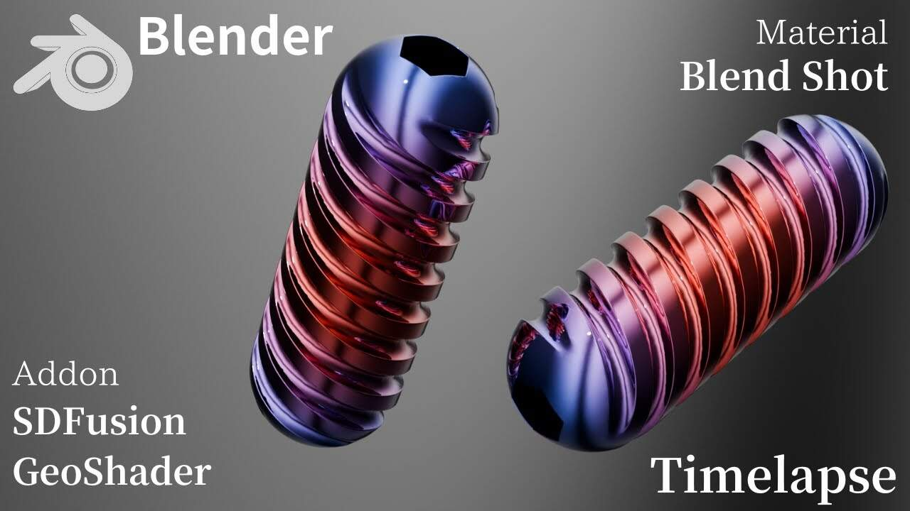

import ReactPlayer from 'react-player';

**SDFusion**, a new toolkit addon by developer Hinata Fugu, brings an intuitive, SDF (Signed Distance Field)-like workflow for non-destructive boolean and remeshing operations to Blender.

  <ReactPlayer
    className="react-player"
    url="https://www.youtube.com/watch?v=hF-PL5eetSI"
    width="100%"
    height="100%"
    controls={true}
  />

### Key Features

*   **Intuitive Layer Operations**: Simply place objects into "ADD" or "SUB" collections. No complex modifier setup is required.
*   **Non-Destructive Workflow**: Adjust the position and shape of cutter objects at any time, allowing for iterative design and experimentation.
*   **Real-time Control**: Instantly adjust the resolution and smoothness of the entire model with sliders and preview the results in real-time.
*   **One-Click Finalize & Organize**: Apply all calculations and generate a clean mesh with a single button. Used cutters are automatically stored in a separate collection, keeping your scene tidy.

:::note[Who is this for?]
SDFusion is highly recommended for:
*   Artists who find boolean operations difficult and want a simpler method.
*   Hard-surface modelers looking to streamline their workflow.
*   Concept designers who need to bring ideas to life quickly.
*   Anyone who wants to reduce their overall modeling time.
:::

#### Included Cutter Asset Pack
The addon comes bundled with a high-quality collection of original cutter assets perfect for hard-surface modeling and concept design. This eliminates the need to create basic cutting shapes from scratch, dramatically speeding up the modeling process.

### Package Contents
*   SDFusion Addon (`__init__.py`)
*   Original Cutter Asset Collection (`.blend` file)

:::caution Important Note
The addon provides an **SDF-like** experience. It does not use Geometry Nodes but is structurally a boolean workflow based on collections.
:::

:::tip[Get SDFusion]
You can get the latest version of SDFusion for **free** on Booth. It is also available for **$2** on Superhive. An older version is also available for free on the developer's Note page.

*   **[➡️ Get SDFusion on BOOTH (Free)](https://hinata-hugu29.booth.pm/items/7194778)**
*   **[➡️ Get SDFusion on Superhive ($2)](https://superhivemarket.com/products/sdfusion?ref=185)**
*   **[➡️ Read more on Note (Older version)](https://note.com/gentle_lupine925/n/n7bf9feecac06)**
:::

#### Acknowledgements
The development of SDFusion was greatly influenced by pioneering addons like **Boolean Quick Remesh (BQR)** and **Simply Concept**. SDFusion honors the concept of an intuitive boolean workflow they introduced while exploring a new approach that utilizes Blender's native collection system for a simpler, more organized user experience.
